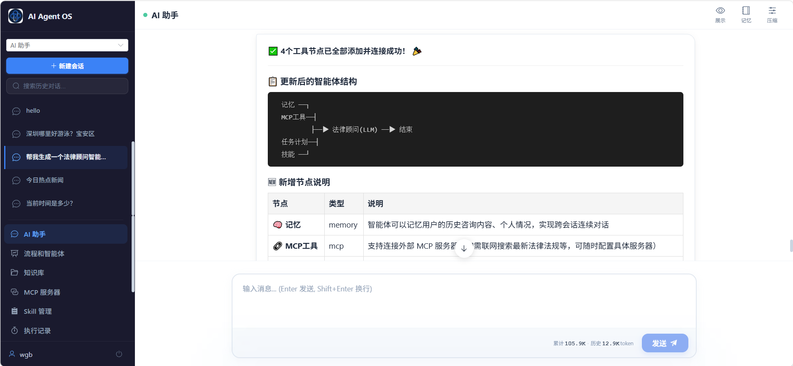
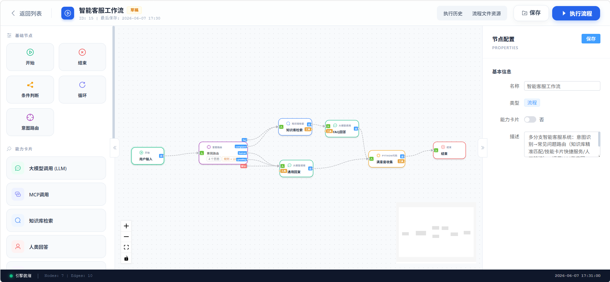
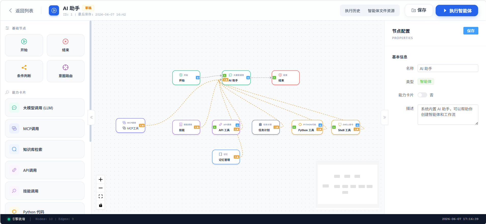

# 智能体平台

[](https://www.python.org/)
[](https://fastapi.tiangolo.com/)
[](https://vuejs.org/)
[](https://github.com/langchain-ai/langgraph)
[](LICENSE)
[](https://gitee.com/wgb20000527/langgraph-agent)

轻量 AI 智能体平台，个人和团队均可使用。个人用户默认 SQLite 零配置启动，一行命令即可运行；团队部署支持 MySQL + Docker，单进程架构 2-3 个容器即可上线。





## 与同类项目对比

| 维度 | 本项目 | Dify | OpenClaw | DeerFlow |
|------|--------|------|----------|----------|
| **部署门槛** | 个人零配置（SQLite 单进程），团队轻量部署（MySQL + Docker，2-3 容器） | 9+ 容器（API/Worker/DB/Redis/SSO/Web/Plugin/Queue/Sandbox），部署门槛高 | VPS 部署 + Node.js | Docker 多容器 |
| **可视化编排** | 拖拽式画布，条件分支 + 循环 + 嵌套子流程 + 意图路由 | 有工作流画布，但无循环节点和嵌套子流程 | 无可视化编辑器，YAML/CLI 定义 | 无可视化编辑器，Skill 文件驱动 |
| **循环控制** | 计数/条件/forEach 三种模式，支持顺序和并发，嵌套校验 | 不支持循环节点 | 不支持 | 不支持 |
| **流程复用** | 能力卡片，子图递归展开嵌套引用，变量隔离 | 工作流模板，无运行时子图嵌套 | 无 | 子 Agent 编排（非可视化） |
| **记忆系统** | 三层记忆（热/温/冷），自动升降温 + AI 总结 + 访问衰减 | 基于对话的短期记忆，无分层 | 会话级短期记忆 | Mem0 长期记忆（[issue #1590](https://github.com/bytedance/deer-flow/issues/1590) 提出引入分层但未实现） |
| **知识库** | 三层导航（文档→标题树→段落）+ AI 知识沉淀 + 向量/LIKE 回退 | RAG 知识库，多数据源，检索成熟 | 无内置 | 无内置 |
| **人工交互** | LangGraph 原生 interrupt()，多轮交互，前端弹窗恢复 | 人工审核节点 | Wait for Input | 无 |
| **MCP 集成** | 持久化会话 + 自愈重连 + 工具缓存 + DB 状态持久化 | 支持 | 工具函数调用 | 支持 |
| **扩展方式** | 放文件即生效（目录扫描 + 装饰器自动注册），个人开发者最友好 | 内置节点为主，扩展需改代码 | Skill 文件 | Skill + SubAgent |

### 核心优势

**1. 开箱即用 — 一行命令启动**

Dify 需要 9+ 个容器、Redis、MySQL 才能跑起来，部署成本高。本项目默认 SQLite，`poetry install` 之后 `poetry run uvicorn main:app --reload` 直接运行，个人电脑直接跑，团队部署也只需 MySQL + Docker 2-3 个容器。

**2. 唯一具备 可视化编排 + 循环 + 嵌套子流程 的开源 AI 平台**

Dify 有可视化但缺少循环节点和嵌套子流程；OpenClaw/DeerFlow 无可视化编辑器。个人用户在画布上拖拽就能构建条件分支、循环体、嵌套能力卡片，不需要写代码、不需要配 YAML。

**3. 三层记忆（同类最完善）**

Dify 仅有短期对话记忆，DeerFlow 尚未实现分层记忆。本项目的热/温/冷三层记忆完全自动化运行：搜索命中自动升温、久未访问自动衰减、超限自动 AI 总结整理，个人用户无需手动管理。

**4. 放文件即生效的插件扩展**

新增节点类型、AI Provider、API 路由只需在对应目录创建文件，自动扫描注册，零配置扩展。个人开发者可以轻松定制自己的专属工具节点。

## 功能特性

- **双模式** — Flow 模式（可视化工作流编排）和 Agent 模式（对话式 AI 助手），共享执行引擎
- **可视化流程编排** — 拖拽式流程设计，支持条件分支、循环、嵌套子流程
- **多模型支持** — 6 个 AI Provider：DeepSeek、OpenAI 兼容、Anthropic、通义千问、智谱AI、MiniMax，可扩展
- **流程复用** — 能力卡片机制，支持流程嵌套和组合
- **三层记忆** — 热/温/冷分层记忆，自动升降温、AI 总结整理、访问衰减
- **知识库** — 三层导航 + AI 知识沉淀，渐进式文献浏览
- **人工交互** — LangGraph 原生 `interrupt()` 实现 Human-in-the-loop
- **MCP 集成** — 持久化会话、工具名前缀、自愈重连、工具缓存
- **Python 沙箱** — AST 级安全隔离，50+ 黑名单模块
- **Skill 系统** — Markdown 技能文档，LLM 自主理解并执行
- **流式推理** — 支持 DeepSeek thinking、Anthropic thinking 推理过程流式输出
- **媒体生成** — 图片/音频/视频生成工具（OpenAI/Anthropic/MiniMax）
- **定时任务** — 基于 APScheduler 的 Cron 定时触发，支持 Flow/Agent 执行目标
- **日程管理** — 完整 CRUD + FullCalendar 日历视图 + APScheduler 提醒推送 + Agent 工具节点
- **执行追踪** — 完整的节点级执行记录和状态追踪
- **扩展性强** — 注册表模式 + 自动发现，放文件即生效
- **轻量部署** — 默认 SQLite 零配置启动，单服务架构，支持 Docker 和 PyInstaller/Nuitka 打包

## 技术栈

**后端**: Python 3.12 | FastAPI | SQLAlchemy 2.0 (aiomysql/aiosqlite) | Pydantic v2 | LangGraph | ChromaDB | APScheduler

**前端**: Vue 3 | TypeScript | Vite | Element Plus | Vue Flow | Pinia | Axios

**AI**: LangChain | DeepSeek | OpenAI Compatible | Anthropic | 通义千问 | 智谱AI | MiniMax | langchain-mcp-adapters

## 快速开始

### 环境要求

| 工具 | 版本要求 |
|-----|---------|
| Python | 3.12 |
| Node.js | 18+ |
| Poetry | 最新版本 |

> 默认使用 SQLite，无需安装数据库。如需 MySQL，修改 `.env` 中 `DATABASE_TYPE=mysql` 即可。

### 后端启动

```bash
poetry install
cp .env.example .env    # 按需修改配置
poetry run uvicorn main:app --reload
```

启动后自动打开浏览器，首次访问会进入初始化向导。

**后端服务**: http://localhost:8000
**API 文档**: http://localhost:8000/docs（仅 DEBUG=true 时可用）

### 前端启动（开发模式）

```bash
cd frontend
npm install
npm run dev
```

**前端服务**: http://localhost:3000（`/api` 请求自动代理到后端 8000 端口）

## 部署

### EXE 打包部署

项目提供一键构建脚本，将后端编译为独立可执行文件。

> **源码保护**：项目的核心业务代码（`app/` 整个包）经 Nuitka 编译为二进制模块（`.pyd` / `.so`），打包后**不含任何 Python 源码文件**，第三方库仍为 `.pyc` 字节码。

```bash
# 完整构建（Nuitka 编译 + PyInstaller 打包）
poetry run python scripts/build.py 0.2.0

# 跳过 Nuitka 编译（仅 PyInstaller 打包）
poetry run python scripts/build.py 0.2.0 --skip-nuitka
```

脚本自动执行以下步骤：

| 步骤 | 说明 |
|------|------|
| 0/5 | 设置版本号（`app/config/version.py` + `pyproject.toml`） |
| 1/5 | 构建前端（已有 `frontend/dist/index.html` 则跳过） |
| 2/5 | 生成静态导入列表（`scripts/generate_static_imports.py`） |
| 3/5 | Nuitka 编译 `app` 包为二进制模块（`app.cp312-win_amd64.pyd` / `app.cpython-*.so`） |
| 4/5 | PyInstaller 打包为 onedir 目录（`dist/langgraph_agent/`） |
| 5/5 | 创建运行时目录（`uploads/`、`data/`、`logs/`）并复制 `.env` |

**打包前提**：

- Python 3.12 + Poetry + Node.js 18+
- `pyproject.toml` 中已声明 `pyinstaller` 和 `nuitka` 依赖（`poetry install` 即可安装）
- `logo.ico` 文件存在于项目根目录（PyInstaller 图标）

**产物结构**：

```
dist/langgraph_agent/
├── langgraph_agent.exe          # 可执行文件
├── _internal/                   # PyInstaller 内部资源
│   ├── app.cp312-win_amd64.pyd  # app/ 包编译后的二进制模块（无 Python 源码）
│   ├── frontend/dist/           # 前端静态文件
│   └── skills/                  # 技能文件
├── uploads/                      # 上传文件目录
├── data/                         # SQLite 数据库目录
├── logs/                         # 日志目录
└── .env                          # 配置文件（从 .env.example 复制）
```

**运行方式**：双击 `langgraph_agent.exe` 或命令行执行，`.env` 放在 exe 同级目录即可。默认使用 SQLite，零配置启动。

> **注意**：打包后 `app/` 目录的 Python 源码已全部编译为单个二进制模块文件（如 `app.cp312-win_amd64.pyd`），反编译难度较高。如需更高保护级别，可使用纯 Nuitka `--standalone` 模式打包（见 `app/config/build_utils.py` 中的 Nuitka 路径支持）。

### Docker 部署

```bash
# 环境层（MySQL）
cd docker && docker-compose -f docker-compose-env.yml up -d

# 应用层（构建镜像并启动）
docker-compose up -d --build
```

### 生产环境

**后端**:
```bash
pip install gunicorn
gunicorn main:app -w 4 -k uvicorn.workers.UvicornWorker -b 0.0.0.0:8000
```

**前端构建**:
```bash
cd frontend && npm run build
# dist 目录由后端 StaticFiles 直接托管，无需单独部署 Nginx
```

生产模式下前端静态文件由 FastAPI 直接托管（`main.py` 中 `StaticFiles(html=True)`），因此只需部署后端服务即可。

## 项目结构

```
langgraph-agent/
├── app/                        # 后端
│   ├── config/                 # 配置、数据库、日志、版本、打包兼容
│   ├── constants/              # 静态常量（节点类型标签等）
│   ├── api/                    # API 路由（自动注册，必须导出 router）
│   ├── models/                 # SQLAlchemy 模型（自动加载，禁止外键）
│   ├── schemas/                # Pydantic Schema
│   ├── services/               # 业务逻辑层（BaseService 泛型 CRUD）
│   ├── middleware/              # 全局异常处理器 + 认证中间件 + 安全头中间件
│   ├── agent_flow/             # LangGraph 流程执行引擎
│   │   ├── node_handlers/      #   节点处理器（19 种，自动注册）
│   │   │   ├── llm_*.py        #     LLM 节点模块化拆分（主入口 + factory + stream + message + executor）
│   │   ├── ai_provider/        #   AI 模型提供商（6 种，自动注册）
│   │   ├── flow_context.py     #   FlowState 状态定义 + reducer
│   │   ├── graph_builder.py    #   StateGraph 构建器
│   │   ├── edge_router.py      #   通用边路由（condition/expression/普通边/循环守卫）
│   │   ├── tool_resolver.py    #   工具发现（扫描 source_handle="tools" 边）
│   │   ├── tool_output_truncate.py # 工具输出统一截断（JSON 感知，阈值可配置）
│   │   ├── subgraph_builder.py #   子图构建器基类
│   │   ├── subgraph_runner.py  #   子图流式执行器
│   │   ├── card_subgraph.py    #   卡片子图构建器
│   │   ├── loop_subgraph.py    #   循环体子图构建器
│   │   ├── execution_context.py #  执行上下文（ContextVar 跨层级传递）
│   │   ├── mcp_manager.py      #   MCP 服务器管理（持久化会话 + 自愈重连）
│   │   ├── mysql_checkpointer.py # MySQL Checkpointer（ormsgpack + gzip）
│   │   ├── variable_resolver.py  # 统一变量解析器
│   │   ├── message_buffer.py    # 对话消息缓冲区
│   │   └── ...                 #   handler_registry, safe_eval, exceptions
│   └── utils/                  # 工具函数（loader.py 自动加载机制）
├── frontend/src/               # 前端
│   ├── api/                    # API 请求封装
│   ├── components/
│   │   ├── FlowEditor/         #   流程编辑器（nodeRegistry.ts 注册表 + Vue Flow，nodes/ + config/ + components/）
│   │   ├── AgentChat/          #   Agent 对话组件
│   │   └── common/            #   共享组件
│   ├── composables/            # Vue 组合式函数
│   ├── constants/              # 配置常量
│   ├── stores/                 # Pinia 状态管理
│   ├── types/                  # TypeScript 类型定义
│   ├── views/                  # 页面组件（17 个）
│   └── utils/                  # 工具函数
├── main.py                     # 后端入口
├── pyproject.toml              # Poetry 依赖配置
└── docker/                     # Docker 部署配置
```

## 核心概念

### 双模式

| 模式 | 说明 | 允许的节点 |
|------|------|-----------|
| **Flow** | 可视化工作流编排，Start → End 完整流程 | 全部 19 种节点 |
| **Agent** | 对话式 AI 助手，单 LLM + 工具节点 | 排除 card/loop/human，memory 和 agenda 仅 Agent 可用 |

### 节点类型

| 节点类型 | 说明 | 可用模式 |
|---------|------|---------|
| **start** | 流程入口，定义输入参数 | Flow / Agent |
| **end** | 流程出口，定义输出变量 | Flow / Agent |
| **llm** | 大模型调用，ReAct 循环 + 流式推理 + 工具调用 | Flow / Agent |
| **condition** | 条件分支，支持 AND/OR 逻辑和 12 种运算符 | Flow / Agent |
| **card** | 能力卡片，引用其他流程作为子图执行 | Flow |
| **loop** | 循环节点，支持计数/条件/forEach 三种模式，顺序或并发执行 | Flow |
| **intent_router** | 意图路由，LLM 判断意图后分支 | Flow / Agent |
| **mcp** | MCP 工具提供者（不加入执行图，仅作为 LLM 工具发现源） | Flow / Agent |
| **knowledge** | 知识库，三层导航 + AI 知识沉淀 | Flow / Agent |
| **memory** | 三层记忆（热/温/冷），仅 Agent 模式可用 | Agent |
| **human** | 人工输入，LangGraph interrupt 暂停等待用户响应 | Flow |
| **api** | 外部 API 调用（GET/POST/PUT/DELETE），支持文件上传下载 | Flow / Agent |
| **skill** | 技能加载，LLM 读取 Markdown 技能文档并自主执行 | Flow / Agent |
| **python** | Python 代码沙箱执行，AST 级安全隔离 | Flow / Agent |
| **shell** | Shell 命令执行 | Flow / Agent |
| **todo** | 任务计划，LLM 自主进行任务拆分与进度跟踪 | Flow / Agent |
| **agenda** | 日程管理，LLM 自主创建/查询/更新/删除日程 | Flow / Agent |
| **sub_agent** | 子 Agent 调用，引用已发布的 Agent 作为子任务执行器 | Flow / Agent |

### 变量引用

- `input.xxx` — 访问流程输入参数
- `variables.xxx` — 访问流程变量（其他节点的输出）
- `output.xxx` — 访问输出数据
- `nodes.{node_key}.xxx` — 访问指定节点的输出变量（子流程中常用）

无前缀时按 context > input > variables 优先级自动查找。

### 工具连接模式

工具节点（MCP、知识库、记忆、Skill、API 等）通过 `source_handle="tools"` 边连接到 LLM 节点，不加入 LangGraph 执行图，仅用于运行时工具发现：

```
[MCP 节点] ──tools──> [LLM 节点] <──tools── [知识库节点]
                          │
                     [执行时自动发现并加载工具]
```

### 执行状态

| 状态 | 说明 |
|-----|------|
| PENDING (0) | 等待执行 |
| RUNNING (1) | 执行中 |
| SUCCESS (2) | 执行成功 |
| FAILED (3) | 执行失败 |
| CANCELLED (4) | 已取消 |
| WAITING_INPUT (5) | 等待人工输入 |

## 认证系统

基于 session cookie 的简单密码认证（非 JWT），密码来源优先级：DB > `.env`。

首次访问进入初始化向导 `/setup`，可设置登录密码（可选，留空不启用）。后续在 `/settings` 修改密码或关闭登录保护。

## 环境变量配置

```env
# 数据库配置（默认 SQLite，零配置启动）
DATABASE_TYPE=sqlite
SQLITE_DB_PATH=data/langgraph_agent.db

# MySQL 配置（DATABASE_TYPE=mysql 时生效）
DATABASE_HOST=localhost
DATABASE_PORT=3306
DATABASE_USER=root
DATABASE_PASSWORD=your_password
DATABASE_NAME=langgraph_agent

# 应用配置
APP_HOST=0.0.0.0
APP_PORT=8000
DEBUG=true

# Embedding 配置（知识库向量化需要）
EMBEDDING_API_KEY=
EMBEDDING_BASE_URL=
EMBEDDING_MODEL=

# 登录密码（可选，为空不启用。DB 中 global_config 优先级更高）
LOGIN_PASSWORD=your_password

# 工具输出截断（超过阈值时保存到临时文件，返回预览）
TOOL_OUTPUT_MAX_LINES=500
TOOL_OUTPUT_MAX_BYTES=10240
```

完整配置见 [.env.example](.env.example)。

## 代码检查

```bash
# 后端（无测试框架）
poetry run ruff format app/             # 格式化
poetry run ruff check app/ --fix        # 检查并修复

# 前端（无测试框架）
cd frontend
npm run lint                            # ESLint 检查（自动修复）
npm run format                          # Prettier 格式化
```

## 相关文档

- [AGENTS.md](AGENTS.md) — AI 代理开发指南（代码规范、架构约定、注意事项）
- [frontend/AGENTS.md](frontend/AGENTS.md) — 前端开发指南

## 许可证

[MIT](LICENSE)
